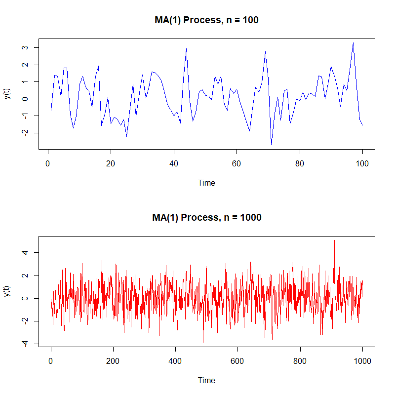
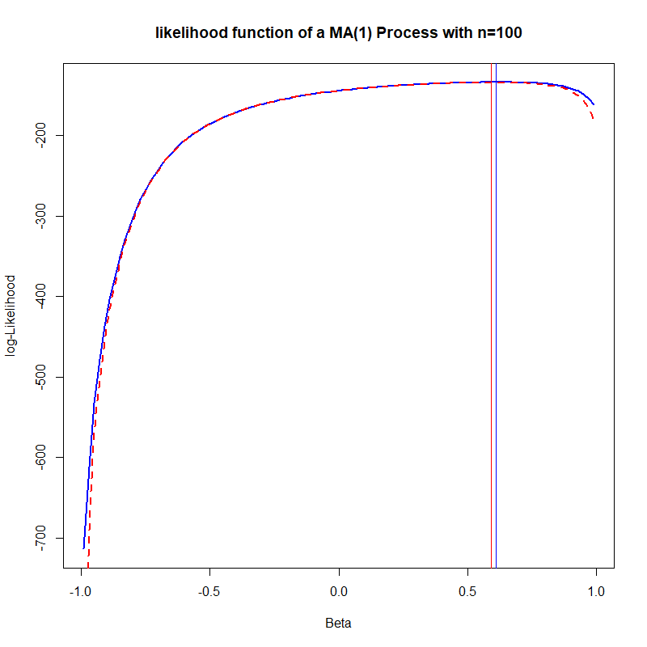

[](http://quantlet.de/)

## [](http://quantlet.de/) **SFElikma1** [](http://quantlet.de/)

```yaml

Name of QuantLet: SFEMA1

Published in: Statistics of Financial Markets

Description: 'Plots two realizations of an MA(1) (moving average) process with MA coefficient beta,  simulate from an arima model with innovations n1 and n2.'

Keywords: moving-average, stationary, linear, discrete, simulation, time-series, process, stochastic-process, stochastic, plot, graphical representation

Author: Ranqing Song

Submitted: January 29 2020 by Ranqing Song

Input: 
- n1, n2 : lags
- beta : moving average coefficient 


Example: 'An example is produced for beta=0.8, n1=100 and n2=1000.' 

```



### R Code
```r
# clear variables and close windows
rm(list = ls(all = TRUE))
graphics.off()

# install and load packages
libraries = c("stats")
lapply(libraries, function(x) if (!(x %in% installed.packages())) {
  install.packages(x)
})
lapply(libraries, library, quietly = TRUE, character.only = TRUE)

# parameter settings
n1   = 100
n2   = 1000
beta = 0.8

# simulation of MA(1)-processes
set.seed(123)
x1 = arima.sim(n = n1, list(ma = beta), innov = rnorm(n1))
x2 = arima.sim(n = n2, list(ma = beta), innov = rnorm(n2))

# Plot
par(mfrow = c(2, 1))
par(mfg = c(1, 1))
plot.ts(x1, col = "blue", ylab = "y(t)")
title(paste("MA(1) Process, n =", n1))
par(mfg = c(2, 1))
plot.ts(x2, col = "red", ylab = "y(t)")
title(paste("MA(1) Process, n =", n2))

```

```r
# clear variables and close windows
rm(list = ls(all = TRUE))
graphics.off()

# parameter settings
n    = 100
beta = 0.5

#generate time-series data set
set.seed(123)
x = arima.sim(n = n, list(ma = beta), innov = rnorm(n))
x = matrix(x)

#generate candidates for estimated beta, -1<beta<1
betahat = seq(from = -0.99, to = 0.99, by = 0.02)
k= 100
li = c(1:k)
cli = c(1:k)
e = c(1:n)
e[1] = x[1]

# likelihood function, assuming standard normal distributed errors
for (i in 1:k){
  b = betahat[i]
  gamma0 = diag(1+b^2, n, n)
  gamma1 = diag(b, n-1, n-1)
  gamma1 = cbind(0, gamma1)
  gamma1 = rbind(gamma1, 0)
  tgamma1 = t(gamma1)
  gamma = gamma0 + gamma1 + tgamma1
  betacoef = (-b) ^ (1:(n-1))
  #unconditional maximal likelihood function
  li[i] = -n/2 * log(2*pi) - 1/2 * log(det(gamma)) - 1/2 * t(x) %*% solve(gamma) %*% x
  #error terms
  for (j in 2:n){
    e[j] = x[j] + sum(betacoef[1:(j-1)] * x[(j-1):1, 1])
  }
  #conditional maximal likelihood function
  cli[i] = -n/2 * log(2*pi) - 1/2 * log(det(gamma)) - 1/2 * sum(e^2)
}

#plot the likelihood functions
output = cbind(betahat, li, cli) 
plot(output[,c(1,2)], col = 4, xlab = "Beta", ylab = "log-Likelihood",type = "l", lwd = 2, 
     main = paste("likelihood function of a MA(1) Process with n=", n, sep = ""))
abline(v = output[which.max(li),1], col = "blue")
points(output[, c(1,3)], type = "l", col = 2, lty = 2, lwd = 2)
abline(v = output[which.max(cli),1], col = "red")

```

```r
# clear variables and close windows
rm(list = ls(all = TRUE))
graphics.off()

# parameter settings
n    = 1000
beta = 0.5

#generate time-series data set
set.seed(123)
x = arima.sim(n = n, list(ma = beta), innov = rnorm(n))
x = matrix(x)

#generate candidates for estimated beta, -1<beta<1
betahat = seq(from = -0.99, to = 0.99, by = 0.02)
k= 100
li = c(1:k)
cli = c(1:k)
e = c(1:n)
e[1] = x[1]

# likelihood function, assuming standard normal distributed errors
for (i in 1:k){
 b = betahat[i]
 gamma0 = diag(1+b^2, n, n)
 gamma1 = diag(b, n-1, n-1)
 gamma1 = cbind(0, gamma1)
 gamma1 = rbind(gamma1, 0)
 tgamma1 = t(gamma1)
 gamma = gamma0 + gamma1 + tgamma1
 betacoef = (-b) ^ (1:(n-1))
 #unconditional maximal likelihood function
 li[i] = -n/2 * log(2*pi) - 1/2 * log(det(gamma)) - 1/2 * t(x) %*% solve(gamma) %*% x
 #error terms
 for (j in 2:n){
   e[j] = x[j] + sum(betacoef[1:(j-1)] * x[(j-1):1, 1])
 }
 #conditional maximal likelihood function
 cli[i] = -n/2 * log(2*pi) - 1/2 * log(det(gamma)) - 1/2 * sum(e^2)
}

#plot the likelihood functions
output = cbind(betahat, li, cli) 
plot(output[,c(1,2)], col = 4, xlab = "Beta", ylab = "log-Likelihood",type = "l", lwd = 2, 
     main = paste("likelihood function of a MA(1) Process with n=", n, sep = ""))
abline(v = output[which.max(li),1], col = "blue")
points(output[, c(1,3)], type = "l", col = 2, lty = 2, lwd = 2)
abline(v = output[which.max(cli),1], col = "red")

```
